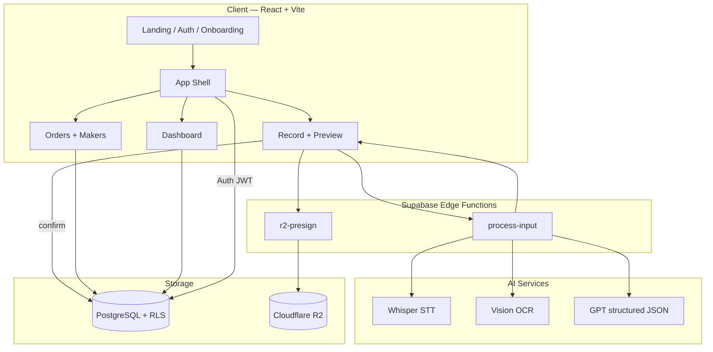
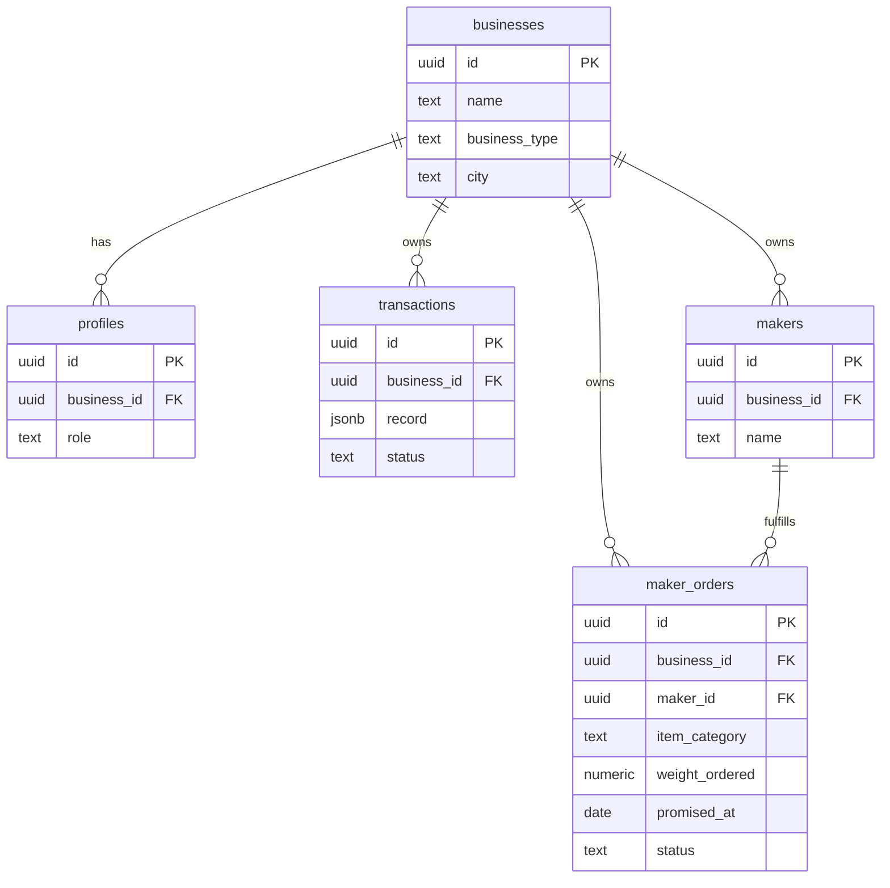
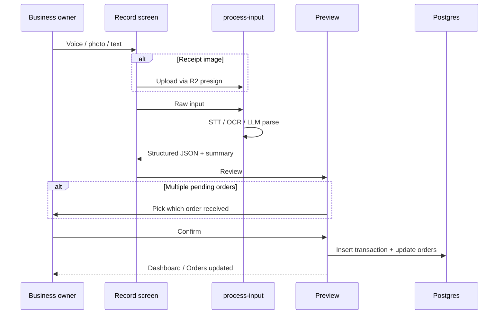
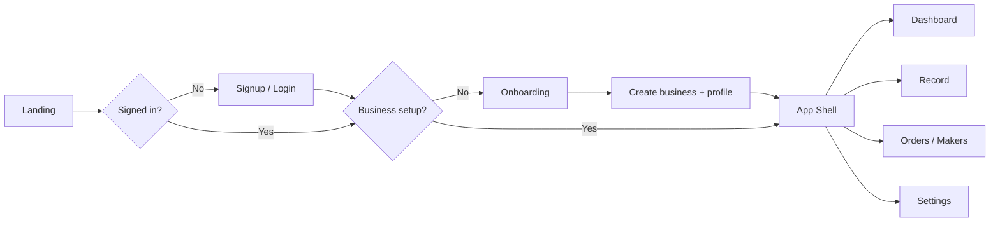

# OrnateOS

**Multilingual voice-to-ledger SaaS** for jewellery businesses. Each owner gets a private workspace — memos, inventory, maker orders, and per-karigar dashboards.

## Product features

| Feature | Description |
|---------|-------------|
| **Multi-tenant** | Sign up → create business → isolated data (Supabase RLS) |
| **Record** | Voice, receipt photo (R2), or text in Gujarati/Hindi/English |
| **Maker orders** | Track who has what, order date, promised delivery, receive flow |
| **Per-maker dashboard** | Pending, overdue, turnaround, history by item type |
| **Business dashboard** | Inventory, memos, exposure, pending orders |
| **Receive disambiguation** | Pick the right order when multiple are pending |

## Architecture

### System overview



Each **business** is a tenant. Row Level Security ensures users only read and write rows where `business_id` matches their profile.

### Multi-tenant data model



### Record → ledger pipeline



### Auth and workspace flow



**Demo mode** (no Supabase env): the same flows run with `localStorage` keyed by `business_id` instead of Postgres.

## User flow

1. **Landing** → Sign up / Log in  
2. **Onboarding** → Business name, type (wholesaler / retailer / manufacturer)  
3. **App** → Sidebar (desktop) or bottom nav (mobile): Home, Record, Orders, Makers, Settings  

### Demo without Supabase

Any email + password works. Data is stored per business in `localStorage`.

### Production (Supabase)

```bash
cp .env.example .env
# Add VITE_SUPABASE_URL and VITE_SUPABASE_ANON_KEY

npx supabase login
npx supabase link --project-ref YOUR_REF
npx supabase db push
npx supabase functions deploy process-input
npx supabase functions deploy r2-presign
```

Enable **Email** provider in Supabase Auth.

## Run locally

```bash
npm install
npm run dev
```

Open http://localhost:5173

## Routes

| Route | Access |
|-------|--------|
| `/` | Landing |
| `/signup`, `/login` | Auth |
| `/onboarding` | New business setup |
| `/dashboard` | Home |
| `/record` | Voice / image / text input |
| `/preview` | Confirm AI result |
| `/orders` | Maker orders |
| `/makers`, `/makers/:id` | Maker hub & detail |
| `/settings` | Business profile |

## Stack

- React + Vite + Tailwind  
- Supabase Auth + Postgres + RLS  
- Edge Functions (Whisper, Vision, LLM)  
- Cloudflare R2 (receipts)  

## License

MIT
